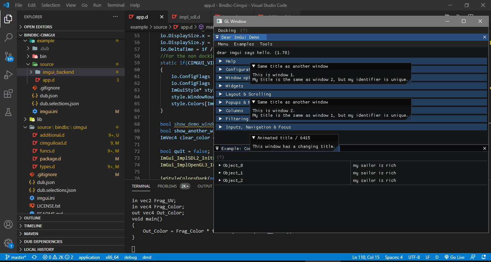
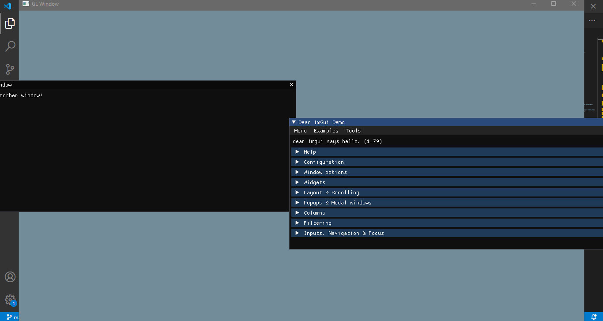

# BindBC-Cimgui

BetterC bindings for [cimgui](https://github.com/cimgui/cimgui/)

I tried my best to follow what @mdparker has been doing.

I only provide OpenGL3 and SDL2 backends (see the example folder).
These are *not included* if you install this via dub. 
You will have to copy them from the example folder.

I made this binding with [bindbc-generator](https://github.com/MrcSnm/bindbc-generator) with some additional things that cimgui needs, found at `source/bindbc/cimgui/additional.d`.
The only other dub package which provides ImGui bindings is [DerelicImGui](https://github.com/extrawurst/DerelictImgui), but it is pretty old, so I made this repo that I'll be supporting for my game engine [HipremeEngine](https://github.com/MrcSnm/HipremeEngine).

The docking and master branch are both supported. 
Docking can be enabled via `CIMGUI_VIEWPORT_BRANCH` version definition.

If you want to use the C++ implementations provided by ImGui, instead of defining custom ones like I did in the example project, you will need to link against them.
In order to do this, pass a callback argument to `loadcimgui` which receives a `SharedLib` which you can then take the needed symbols from, binding them to the respective function pointers.

> Note: When you build cimgui, the implementations are not included by default. 
> You will have to modify the make file in there to add what you need. 
> Also the linking code and the relevant structs and constants will have to be written in D manually, by mirroring them from the C++ source.

The particular implementations in the example folder allow either custom implementation or dynamically linking against a precompiled one, controlled via the constant `CIMGUI_USER_DEFINED_IMPLEMENTATION_SDL`. It is set to true by default. Change the source file to override this.

I only provide so many backends, so if you're using something else, you'll have to write it on your own. Use [the official ImGui implementations](cimgui/imgui/backends) as reference.

## How to build ImGui?

See more info on cimgui [in their repo](cimgui).

The steps are basically as follows:
```
git clone --recursive https://github.com/MrcSnm/bindbc-cimgui 
cd bindbc-cimgui 
cmake -Hcimgui -Bbuild -DCMAKE_BUILD_TYPE=RelWithDebInfo
cmake --build build --config RelWithDebInfo
```

[-H](https://cgold.readthedocs.io/en/latest/glossary/-H.html), [-B](https://cgold.readthedocs.io/en/latest/glossary/-B.html#b)

If you need the ImGui backend implementations to be part of the library, include the source files in `cimgui/CMakeLists.txt`.

For example, here I have added the GLFW implementation and the OpenGL3 implementation:
```
file(GLOB IMGUI_SOURCES
    
    imgui/backends/imgui_impl_glfw.cpp
    imgui/backends/imgui_impl_opengl3.cpp

    cimgui.cpp
    imgui/imgui.cpp
    imgui/imgui_draw.cpp
    imgui/imgui_demo.cpp
    imgui/imgui_widgets.cpp
	${TABLES_SOURCE}
)
```

Note that in this case you will also likely need to mess with headers and will likely have to do static linking.
In this case adding the following line for the include won't be enough, since you usually link against GLFW on the D side of things, so it does not compile:
```
target_include_directories(cimgui PUBLIC ${CMAKE_CURRENT_SOURCE_DIR}/imgui/examples/libs/glfw/include)
```

So in that case you will either have to link against the same static GLFW library at compile time in both the C++ and the D land, or link dynamically from both C++ and D land.

> If you have succeeded in doing this, feel welcome to describe what you did with a PR.

> I recommend writing the implementations yourself. 
> The C++ files are almost 1-to-1 translatable to D.
> If you do so, feel free to add it via a PR.


## List of the currently supported versions of ImGui:

### v1.79

Screenshots:




Any PR's are welcome